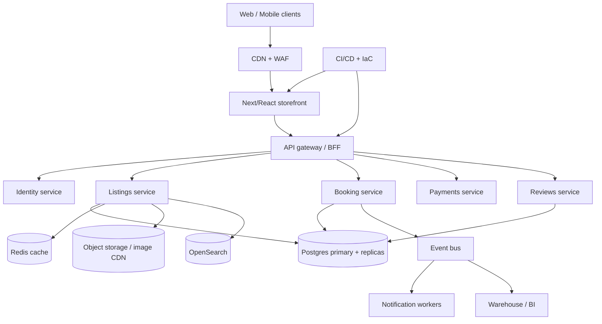

# Production Marketplace Architecture

```mermaid
flowchart TB
  U[Web / Mobile clients] --> CDN[CDN + WAF]
  CDN --> FE[Next/React storefront]
  FE --> GW[API gateway / BFF]
  GW --> ID[Identity service]
  GW --> LS[Listings service]
  GW --> BK[Booking service]
  GW --> PY[Payments service]
  GW --> RV[Reviews service]
  LS --> PG[(Postgres primary + replicas)]
  BK --> PG
  RV --> PG
  LS --> REDIS[(Redis cache)]
  LS --> S3[(Object storage / image CDN)]
  LS --> SEARCH[(OpenSearch)]
  BK --> BUS[Event bus]
  BUS --> NOTIFY[Notification workers]
  BUS --> ANALYTICS[Warehouse / BI]
  CICD[CI/CD + IaC] --> FE
  CICD --> GW
```

See `outputs/architecture-diagram.svg` for the submission-ready diagram.
